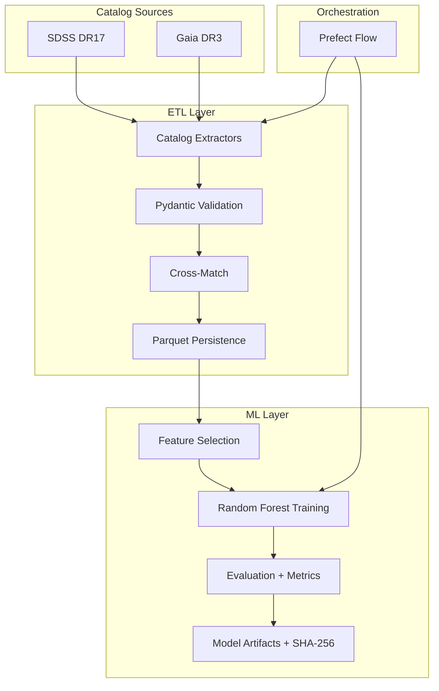

# DeepSky-Classifier

**DeepSky-Classifier** is an astronomical data pipeline and machine learning system that automates extraction, processing, and classification of celestial bodies (**Stars, Galaxies, Quasars**) using spectral data from multiple sky surveys.

Built with Python 3.13, uv, Pydantic V2, and Scikit-Learn.

---

## Architecture



### Stack

| Component | Technology | Purpose |
| --- | --- | --- |
| Language | Python 3.13 | Modern syntax, type hints, match/case |
| Package Manager | uv | Rust-based, instant dependency resolution |
| Extraction | Astroquery + PyVO | SDSS SQL queries and Gaia TAP access |
| Validation | Pydantic V2 | Strict schema contracts at every boundary |
| Storage | Parquet + SQLAlchemy 2 | Columnar analytics + relational metadata |
| ML | Scikit-Learn | Random Forest ensemble classification |
| Orchestration | Prefect 3 | Resilient flows with retries and observability |
| Quality | Ruff + Pytest | Linting and test coverage |

---

## Project Structure

```
src/
  core/
    config.py          Pipeline configuration
    database.py        SQLAlchemy engine and session management
    integrity.py       SHA-256 file verification
    models.py          ORM models (raw + curated tables)
    schemas.py         Pydantic schemas (raw, curated, validation)
  etl/
    catalogs/
      base.py          Abstract catalog extractor interface
      gaia.py          Gaia DR3 TAP extractor
      sdss.py          SDSS DR17 extractor
    crossmatch.py      Catalog cross-matching utilities
    federated.py       Multi-catalog federated pipeline
    ingest.py          SDSS-only baseline pipeline
    persist.py         Parquet/CSV persistence
    validate.py        Row-level schema validation with quarantine
  ml/
    evaluate.py        Classification metrics
    features.py        Feature selection and contract
    train.py           Random Forest training with artifact persistence
  utils/
    logger.py          Colored logging
  workflows/
    pipeline.py        Prefect-orchestrated end-to-end flow
tests/
  test_features.py     Feature contract stability
  test_query.py        SDSS query generation
  test_schemas.py      Schema validation boundaries
```

---

## Data Sources

| Source | Parameters | Classification Contribution |
| --- | --- | --- |
| SDSS DR17 | Optical photometry (u, g, r, i, z), redshift | Baseline: temperature, distance, velocity |
| Gaia DR3 | Parallax, proper motion (pmra, pmdec) | Galactic vs extragalactic separation |

---

## Installation

### Prerequisites

* Python 3.13+
* [uv](https://github.com/astral-sh/uv)

### Setup

```bash
git clone https://github.com/Ayfri/deepsky-classifier.git
cd deepsky-classifier
uv sync
```

### Run the SDSS-only Pipeline

```bash
uv run -m src.etl.ingest
```

### Run the Federated Pipeline (SDSS + Gaia)

```bash
uv run -m src.etl.federated
```

### Train the Model

```bash
uv run -m src.ml.train data/raw/sdss/curated_features.parquet
```

### Run the Full Orchestrated Pipeline

```bash
uv run -m src.workflows.pipeline
```

### Run Tests

```bash
uv run pytest
```

### Lint

```bash
uv run ruff check .
```

---

## License

This project is licensed under the **GNU GPLv3 License**. See the `LICENSE` file for details.
