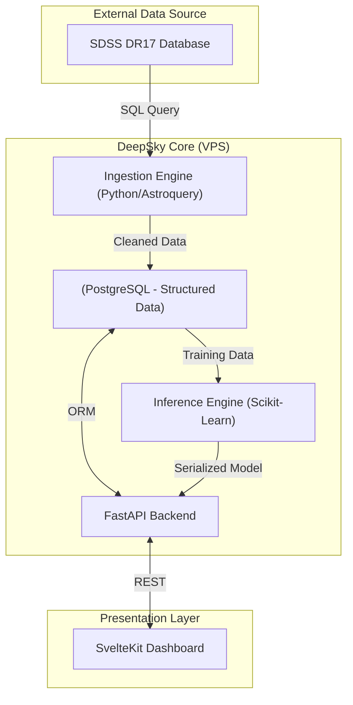

# 🌌 DeepSky-Classifier

**DeepSky-Classifier** is a high-performance astronomical data pipeline and inference engine. It automates the extraction, processing, and classification of celestial bodies (**Stars, Galaxies, Quasars**) using massive datasets from the **Sloan Digital Sky Survey (SDSS)**.

Built with a philosophy of **"Optimization & Type Safety,"** this project leverages modern Python tooling (uv, Ruff, Pydantic V2) to deliver an industrial-grade machine learning solution.

---

## 🎯 Project Scope & Problem Statement

Modern telescopes generate terabytes of data daily, outpacing human analysis capabilities.
**DeepSky-Classifier** addresses this bottleneck by providing:

1. **Automated Ingestion:** A resilient ETL pipeline connecting directly to SDSS databases via SQL.
2. **Multi-Class Classification:** A Random Forest model capable of distinguishing deep-space objects based on spectral fingerprints.
3. **Self-Hosted Infrastructure:** A containerized, privacy-first architecture designed for VPS deployment without reliance on expensive cloud providers.

---

## 🏗️ Technical Architecture

The system follows a strict Microservices architecture wrapped in Docker containers.



### The Stack

| Component | Technology | Rationale |
| --- | --- | --- |
| **Language** | **Python 3.13** | Latest features, significant performance improvements. |
| **Package Manager** | **uv** | Rust-based, instant dependency resolution (replaces Pip/Poetry). |
| **Backend** | **FastAPI** | Async native, auto-documentation, strict Pydantic validation. |
| **Data Source** | **Astroquery** | Official connector for robust SDSS SQL queries. |
| **Database** | **PostgreSQL** | Relational integrity for spectral data. |
| **ML Engine** | **Scikit-Learn** | Random Forest Ensemble for high-accuracy tabular classification. |
| **Frontend** | **SvelteKit** | Reactive, lightweight UI for data visualization. |
| **Quality** | **Ruff** | All-in-one linter (Rust) for industrial code quality. |

---

## 📊 Data Dictionary & Features

The system ingests photometric data from the SDSS `PhotoObj` and `SpecObj` tables.

| Field | Type | Description | Relevance for AI |
| --- | --- | --- | --- |
| `objid` | `int` | Unique SDSS Identifier | Tracking |
| `ra`, `dec` | `float` | Right Ascension / Declination | Sky mapping |
| `u`, `g`, `r`, `i`, `z_mag` | `float` | **Photometric Filters** (Ultraviolet to Infrared) | **High**. The color difference (e.g., `u - g`) indicates temperature/age. |
| `redshift` | `float` | **Redshift (z)** | **Critical**. Measures the object's recessional velocity. <br>

<br>• ~0: Star<br>

<br>• 0.01-0.5: Galaxy<br>

<br>• >1.0: Quasar |
| `class_label` | `str` | **Target Variable** | STAR, GALAXY, QSO |

---

## 🚀 Installation & Usage

### Prerequisites

* Docker & Docker Compose
* [uv](https://github.com/astral-sh/uv) (`curl -LsSf https://astral.sh/uv/install.sh | sh`)

### 1. Local Development Setup

Clone the repository and sync dependencies instantly with `uv`.

```bash
git clone https://github.com/Ayfri/deepsky-classifier.git
cd deepsky-classifier

# Create virtual environment and install deps
uv sync

# Activate venv
source .venv/bin/activate

```

### 2. Run the Data Pipeline (ETL)

We use a specialized script to fetch a **perfectly balanced dataset** (equal distribution of Stars, Galaxies, and Quasars) to avoid model bias.

```bash
# Fetches 2000 objects of each class (6000 total) and saves to DB/CSV
uv run src/etl/ingest.py

```

### 3. Train the Model

Train the Random Forest Classifier on the local data.

```bash
uv run src/ml/train.py --estimators 100
# Output: Model saved to models/rf_classifier.joblib (Accuracy: ~98%)

```

### 4. Production Deployment (VPS)

Deploy the full stack (Database + API + Frontend) using Docker Compose.

```bash
docker-compose up -d --build

```

* **API Docs:** `http://localhost:8000/docs`
* **Frontend:** `http://localhost:3000`

---

## 🧪 Quality Assurance

We enforce strict coding standards via **GitHub Actions**.

* **Linting:** `Ruff` (Checks for unused imports, formatting, complexity).
* **Typing:** `Mypy` (Static type checking).
* **Testing:** `Pytest` (Integration tests for API endpoints).

To run checks locally:

```bash
uv run ruff check . --fix
uv run pytest

```

---

## 📜 License

This project is licensed under the **GNU GPLv3 License**. See the `LICENSE` file for details.
